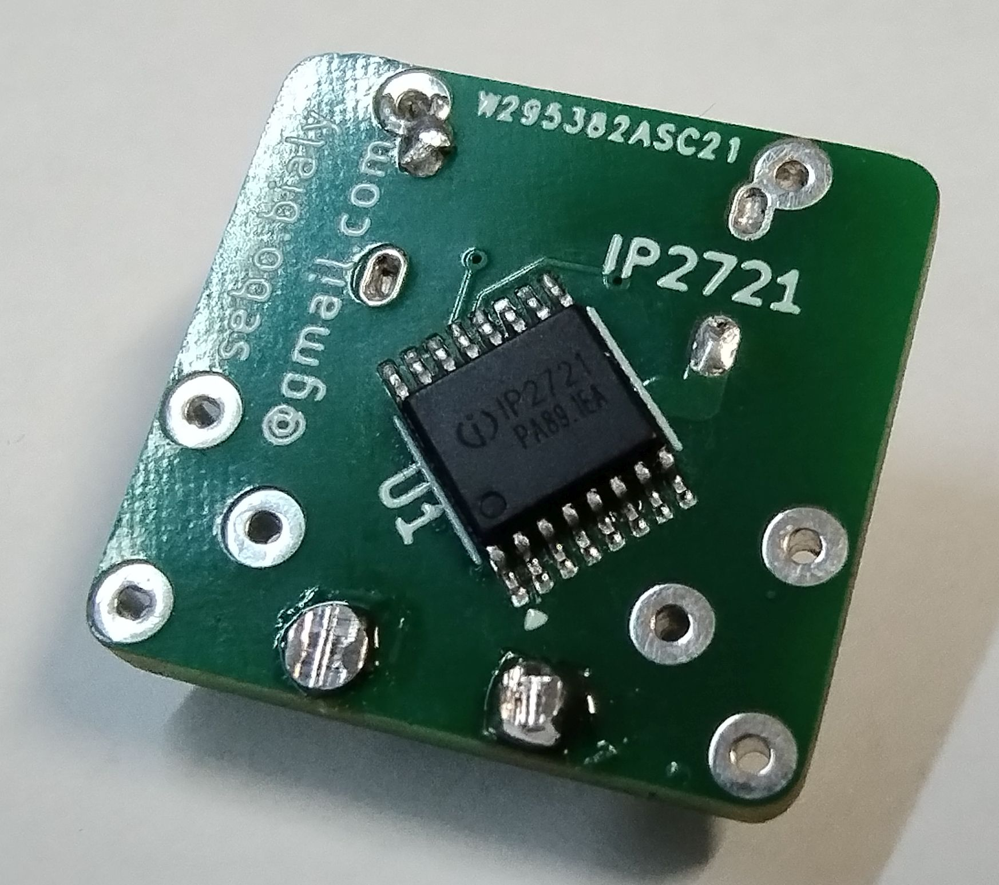

# Introduction

This is a simple power DIN connector USB-C replacement for Atari 8-bit computers with PowerDelivery capability.

# Options

## Simple

* PCB
* USB-C connector

This configuration will work with dumb chargers that do not care about PD. Should work also with USB-C<>USB-A cables.

## Advanced

* PCB
* USB-C connector
* IP2721
* 5.1kOhm resistors

This configuration will work with all PowerDelivery chargers, via USB-C<>UAB-C cables. Should work with power banks, phone chargers, laptop chargers, etc.

## Ultimate

* PCB
* USB-C connector
* IP2721
* 5.1kOhm resistors
* 10nF capacitor
* 5.6V zener diode around 5W
* Polyfuse 1-2A.

This configuration will work with all chargers and additionally protect your hardware from reversed polarity or overvoltage, just in case.

# PCB

PCB was designed using KiCAD. All components are 0805 in size.

# Stand

To properly mount this DIN replacement, you need to print a small stand, using any 3D printer. OpenSCAD file is provided. Please install OpenSCAD, load the design file, press F6, and export STL for printing. You will also need some wires to solder it, trough the stand.
